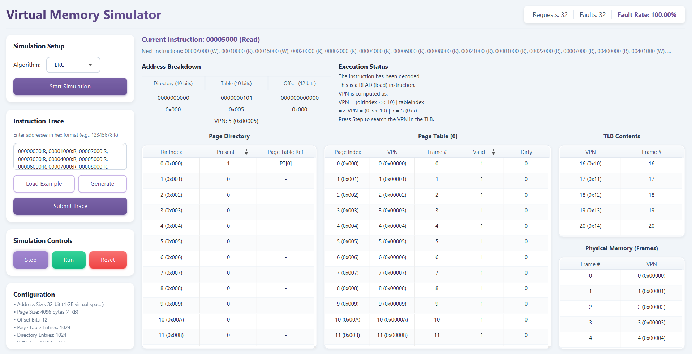

<div align="center">

# Virtual Memory Simulator

### A JavaFX-based educational simulator that visualizes how virtual memory management works in modern operating systems.

[](https://adoptium.net/)
[](https://openjfx.io/)
[](https://maven.apache.org/)

*Interactive step-by-step execution demonstrating TLB lookups, page table walks, and page replacement algorithms*

[Features](#features) •
[System Configuration](#system-configuration) •
[Getting Started](#getting-started) •
[Usage Guide](#usage-guide)

</div>

---

## Table of Contents

- [Features](#features)
- [Screenshots](#screenshots)
- [System Configuration](#system-configuration)
- [Tech Stack](#tech-stack)
- [Getting Started](#getting-started)
- [Usage Guide](#usage-guide)
- [Page Replacement Algorithms](#page-replacement-algorithms)
- [Example Trace Explanation](#example-trace-explanation)
- [Project Structure](#project-structure)
- [Architecture](#architecture)
- [Educational Value](#educational-value)
- [Contributing](#contributing)
- [License](#license)
- [Acknowledgments](#acknowledgments)

---

## Features

<table>
<tr>
<td width="50%">

### Interactive Execution
- **Step-by-Step Visualization**: Walk through each memory access one stage at a time
- **Real-Time Updates**: Watch TLB, Page Directory, Page Tables, and Physical Memory update live
- **Execution Stages**: Breakdown → TLB Search → TLB Result → Execute

</td>
<td width="50%">

### Address Translation
- **32-bit Virtual Addresses**: Complete address breakdown display
- **Two-Level Page Table**: Intel x86-style paging simulation
- **Component Breakdown**: Directory Index, Table Index, and Offset visualization

</td>
</tr>
<tr>
<td width="50%">

### Page Replacement Algorithms
- **FIFO** (First-In, First-Out)
- **LRU** (Least Recently Used)
- **Optimal** (Belady's Algorithm)
- **Algorithm Comparison**: See different strategies in action

</td>
<td width="50%">

### Statistics & Monitoring
- **Page Fault Tracking**: Monitor page fault rates
- **Memory Requests**: Track total memory operations
- **Performance Metrics**: Real-time statistics display
- **Algorithm Performance**: Compare efficiency across algorithms

</td>
</tr>
</table>

---

## Screenshots



The simulator features a modern, card-based UI with:
- Left panel for simulation controls and trace input
- Center panel showing current instruction, address breakdown, and execution status
- Tables displaying Page Directory, Page Table, TLB, and Physical Memory contents
- Real-time statistics in the header

---

## System Configuration

The simulator models a system with the following characteristics:

| Parameter | Value |
|-----------|-------|
| **Address Size** | 32-bit (4 GB virtual address space) |
| **Page Size** | 4096 bytes (4 KB) |
| **Offset Bits** | 12 |
| **Directory Index Bits** | 10 (1024 entries) |
| **Table Index Bits** | 10 (1024 entries per table) |
| **VPN Bits** | 20 (Directory + Table) |
| **Physical Frames** | 32 |
| **Physical Memory** | 128 KB |
| **TLB Entries** | 16 |

---

## Tech Stack

<table>
<tr>
<td width="50%" valign="top">

### Core Technologies
- **Java 17+** - Programming language
- **JavaFX 17.0.6** - Rich UI framework
- **Maven** - Build & dependency management

</td>
<td width="50%" valign="top">

### Architecture Layers
- **Presentation Layer** - JavaFX UI components
- **Business Logic** - Memory management algorithms
- **Model Layer** - Memory component data structures

</td>
</tr>
</table>

---

## Getting Started

### Prerequisites

Before you begin, ensure you have the following installed:

| Tool | Version | Download |
|------|---------|----------|
| **Java (JDK)** | 17+ | [Download](https://adoptium.net/) |
| **Maven** | 3.6+ | [Download](https://maven.apache.org/download.cgi) |

> **Note:** JavaFX is automatically downloaded via Maven dependencies.

---

### Installation

#### 1. Clone the Repository

```bash
git clone https://github.com/yourusername/VirtualMemorySimulator.git
cd VirtualMemorySimulator
```

---

#### 2. Build and Run

<details>
<summary><b>Using Maven</b></summary>

```bash
# Build and run the application
mvn clean javafx:run
```

</details>

<details>
<summary><b>Using an IDE</b></summary>

1. Import the project as a Maven project
2. Run `ro.tuc.virtualmemorysimulator.PresentationLayer.App`

</details>

---

## Usage Guide

### Getting Started

| Step | Action | Description |
|------|--------|-------------|
| **1** | **Start Simulation** | Select a replacement algorithm (FIFO, LRU, or Optimal) and click "Start Simulation" |
| **2** | **Enter Trace** | Input memory addresses in hexadecimal format with R/W flags |
| **3** | **Submit Trace** | Click "Submit Trace" to load the addresses |
| **4** | **Execute** | Use "Step" to advance one stage at a time, or "Run" to complete the current instruction |

---

### Input Format

Addresses should be in the format: `ADDRESS:OPERATION`

- `ADDRESS`: 32-bit hexadecimal value (e.g., `12345678`, `0000A000`)
- `OPERATION`: `R` for read, `W` for write

**Examples:**

```
00000000:R, 00001000:R, 00002000:W
```

```
12345678:R
ABCD1234:W
00000000:R
```

---

### Execution Stages

Each memory access goes through **four stages**:

| Stage | Description |
|-------|-------------|
| **1. Breakdown** | Address is decoded into Directory Index, Table Index, and Offset |
| **2. TLB Search** | The VPN is looked up in the Translation Lookaside Buffer |
| **3. TLB Result** | Shows whether it was a TLB hit or miss |
| **4. Execute** | Performs the actual memory access (may trigger page fault) |

---

## Page Replacement Algorithms

<table>
<tr>
<td width="33%">

### FIFO
**First-In, First-Out**

Replaces the page that has been in memory the longest. Simple but can suffer from Belady's anomaly where increasing frames can increase page faults.

</td>
<td width="33%">

### LRU
**Least Recently Used**

Replaces the page that hasn't been accessed for the longest time. Better approximation of optimal but requires tracking access times.

</td>
<td width="33%">

### Optimal
**Belady's Algorithm**

Replaces the page that won't be used for the longest time in the future. Theoretical best but requires future knowledge - useful as a benchmark.

</td>
</tr>
</table>

---

## Example Trace Explanation

The built-in example trace demonstrates key virtual memory concepts across **13 phases**:

<details>
<summary><b>Phase 1: Preload (Instructions 0-31)</b></summary>

Fills all 32 physical frames with VPNs 0-31. After this phase:
- All frames are occupied
- TLB contains only VPNs 16-31 (last 16 accesses, since TLB size = 16)
- VPNs 0-15 are in memory but NOT in TLB

</details>

<details>
<summary><b>Phase 2: TLB Behavior</b></summary>

Demonstrates the difference between TLB hits and page table hits:
- `00005000:R` (VPN 5) - TLB MISS, Page Table HIT (page in memory, not in TLB)
- `0000A000:W` (VPN 10) - TLB MISS, Page Table HIT + sets DIRTY bit
- `00015000:W` (VPN 21) - TLB HIT (still in TLB from preload)

</details>

<details>
<summary><b>Phase 3: First Page Fault</b></summary>

`00020000:R` (VPN 32) causes the first page fault. All algorithms agree:
- FIFO: evicts VPN 0 (oldest in queue)
- LRU: evicts VPN 0 (least recently used)
- Optimal: evicts VPN 0 (not used again soon)

</details>

<details>
<summary><b>Phases 4-5: Algorithm Divergence</b></summary>

After updating LRU timestamps for specific pages, algorithms start making different decisions:
- FIFO follows its queue order blindly
- LRU considers recent access patterns
- Optimal uses future knowledge

</details>

<details>
<summary><b>Phase 6: Belady's Anomaly</b></summary>

`00001000:R` (VPN 1) demonstrates FIFO's weakness:
- FIFO just evicted VPN 1, now needs it again - causes extra page fault
- Optimal kept VPN 1 knowing it would be accessed

</details>

<details>
<summary><b>Phases 7-8: Complete Divergence</b></summary>

All three algorithms choose different victim pages, showing their distinct strategies:
- FIFO: purely chronological
- LRU: based on access history
- Optimal: based on future usage

</details>

<details>
<summary><b>Phases 9-11: Multiple Page Directories</b></summary>

Accesses pages in different directories (1, 2, 5) to show the two-level page table structure working across the full address space.

</details>

<details>
<summary><b>Phases 12-13: Final Verification</b></summary>

Demonstrates the cumulative effects of each algorithm's decisions on overall performance.

</details>

---

## Project Structure

```
VirtualMemorySimulator/
├── src/main/java/ro/tuc/virtualmemorysimulator/
│   ├── BusinessLogic/
│   │   ├── Algorithm.java          # Interface for replacement algorithms
│   │   ├── FIFOAlgorithm.java      # FIFO implementation
│   │   ├── LRUAlgorithm.java       # LRU implementation
│   │   ├── OptimalAlgorithm.java   # Optimal implementation
│   │   └── MemoryManager.java      # Core memory management logic
│   ├── Model/
│   │   ├── Frame.java              # Physical memory frame
│   │   ├── Page.java               # Page table entry
│   │   ├── PageDirectory.java      # First-level page table
│   │   ├── PageTable.java          # Second-level page table
│   │   └── TLB.java                # Translation Lookaside Buffer
│   └── PresentationLayer/
│       ├── App.java                # JavaFX application entry point
│       └── SimulatorController.java # UI controller
├── src/main/resources/ro/tuc/virtualmemorysimulator/
│   ├── SimulatorViewModern.fxml    # Modern UI layout
│   └── simulator-modern.css        # Modern styling
├── pom.xml                         # Maven configuration
└── README.md
```

---

## Architecture

The project follows a **layered architecture**:

<table>
<tr>
<td width="33%">

### Presentation Layer
JavaFX UI components and controllers

</td>
<td width="33%">

### Business Logic
Memory management algorithms and core simulation logic

</td>
<td width="33%">

### Model
Data structures representing memory components

</td>
</tr>
</table>

### Key Components

| Component | Description |
|-----------|-------------|
| **MemoryManager** | Coordinates address translation, TLB lookups, page table walks, and page faults |
| **PageDirectory** | First-level of the two-level page table (1024 entries) |
| **PageTable** | Second-level page tables (1024 entries each) |
| **TLB** | 16-entry fully-associative cache using LRU replacement |
| **Frame** | Represents a physical memory frame |

---

## Educational Value

This simulator helps understand:

<table>
<tr>
<td width="50%">

### Core Concepts
1. **Address Translation** - How virtual addresses map to physical addresses
2. **Two-Level Paging** - Why hierarchical page tables are used
3. **TLB Importance** - The performance impact of TLB hits vs misses

</td>
<td width="50%">

### Advanced Topics
4. **Page Replacement** - Trade-offs between different algorithms
5. **Dirty Bits** - How write operations are tracked for write-back
6. **Page Faults** - What happens when a page isn't in memory

</td>
</tr>
</table>

---

## Contributing

Contributions are welcome! Please feel free to submit pull requests or open issues for:

- Bug fixes
- UI improvements
- Documentation updates
- New replacement algorithms

---

## License

This project is available for educational purposes.

---

## Acknowledgments

Developed as an educational tool for understanding operating system memory management concepts.

---

</div>